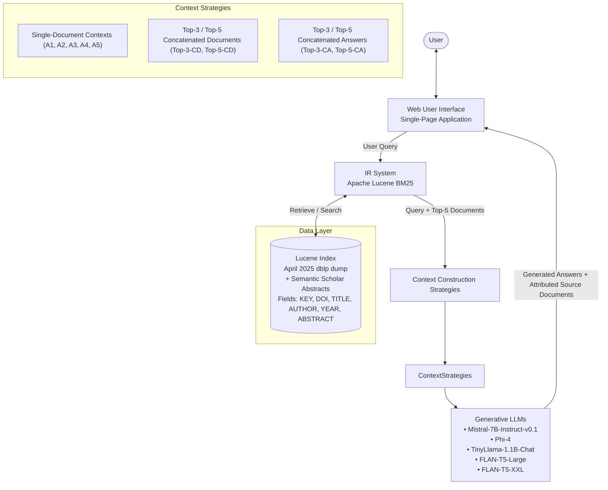

# RAGScholar & DBLP-QA: Explainable Retrieval Augmented Scientific QA on dblp with Source-Attributed Answers and a Benchmark Dataset

**Authors:**
* **Aditya Neekhra** ([adneek@uni-trier.de](mailto:adneek@uni-trier.de)) — [ORCID: 0009-0003-3897-1259](https://orcid.org/0009-0003-3897-1259)
* **Markus Nilles** ([nillesm@uni-trier.de](mailto:nillesm@uni-trier.de)) — [ORCID: 0000-0002-3449-9319](https://orcid.org/0000-0002-3449-9319)
* **Ralf Schenkel** ([schenkel@uni-trier.de](mailto:schenkel@uni-trier.de)) — [ORCID: 0000-0001-5379-5191](https://orcid.org/0000-0001-5379-5191)

*Trier University, Germany*

**Publication Details:**
* **Venue:** SCOLIA ’26: Second International Workshop on Scholarly Information Access (SCOLIA), April 2, 2026, Delft, The Netherlands
* **Proceedings:** CEUR Workshop Proceedings ([ceur-ws.org](https://ceur-ws.org)), ISSN 1613-0073, published 2026-03-26, pp. 62–70
* **License:** Creative Commons License Attribution 4.0 International (CC BY 4.0)

---

## Abstract

Effective question answering (QA) over scientific literature is essential for accelerating research. However, existing benchmarks often fail to capture the complexity and domain-specific reasoning required. To address this gap, we introduce **DBLP-QA**, a benchmark dataset of 50 manually crafted question-answer pairs derived from the abstracts of scientific publications. It is designed to test both the retrieval and generation capabilities of large language models (LLMs) in scientific contexts. To demonstrate its utility, we evaluate **RAGScholar**, a retrieval-augmented generation (RAG) system that integrates external knowledge sources, and compare multiple retrieval and generation strategies. The dataset provides a robust foundation for advancing and objectively evaluating QA systems for scientific literature.

**Keywords:** Retrieval-Augmented Generation, Digital Libraries, Benchmark Question Answer Pair Dataset

---

## 1. Introduction

The rapid growth of scholarly publications has intensified information overload. Traditional academic search engines like Google Scholar or PubMed largely rely on retrieving individual publications, returning ranked lists rather than concise answers, and often do not capture semantic intent or synthesize evidence across papers. LLMs, on the other hand, are good at creating natural language answers, but, without grounding, can hallucinate and lack verifiable citations, limiting their suitability for scholarly QA. Retrieval-augmented generation addresses this by conditioning answers on retrieved evidence. However, domain-specific RAG for bibliographic corpora such as dblp remains underexplored, and there is no manually curated benchmark for reproducible evaluation over computer science publications.

To address these gaps, we introduce **DBLP-QA**, a benchmark of 50 manually crafted question–answer pairs derived from scientific abstracts, and **RAGScholar**, a scholarly QA system that combines a Lucene BM25 retriever with instruction-tuned LLMs. RAGScholar serves as a testbed for evaluating DBLP-QA. We systematically evaluate retrieval performance, context-construction strategies, and model-specific differences under controlled conditions. We focus on four research questions:

* **RQ1:** How effectively does BM25 retrieve a publication whose abstract contains the correct answer?
* **RQ2:** How do different context strategies ranging from single abstracts to concatenated multi-abstract input affect answer quality?
* **RQ3:** Does a two-step strategy, where concatenated answers from single abstracts serve as context, improve final answer quality compared to using multiple retrieved abstracts directly?
* **RQ4:** How does model choice affect performance under identical retrieval and context conditions?

Our contributions are threefold:
1. **DBLP-QA**, a curated benchmark for abstract-based scholarly QA;
2. **RAGScholar**, a system integrating BM25 retrieval with instruction-tuned LLMs; and
3. A **systematic evaluation** of retrieval and context strategies across multiple models.

---

## 2. Related Work

Scientific question answering has been studied through a variety of benchmarks that differ in domain coverage and annotation depth. General-domain datasets such as SQuAD [1] helped establish large-scale QA evaluation but do not match the conceptual density of scientific writing.

Several datasets target QA over scholarly publications. Scientific QA datasets, including BioASQ [2], PubMedQA [3], SciQ [4], and CORD-19–based benchmarks like COVID-QA [5], have advanced domain-specific QA, yet many rely on automatically generated questions or focus narrowly on biomedical literature. QASPER [6] provides thousands of human-written questions grounded in full NLP papers, while QASA [7] focuses on expert-authored, high-level questions requiring deep reasoning across AI/ML articles. Other scientific QA resources, such as SciQA [8], SciDQA [9], or the automatically generated SciQAG [10] offer broader coverage but often include synthetic questions or multimodal elements that differ from abstract-focused QA. Evaluation frameworks like ScholarQABench [11] and SciArena [12] assess literature-grounded responses from large models, but are not designed around curated, abstract-level question-answer pairs.

In contrast to these large, heterogeneous, or full-paper datasets, DBLP-QA provides a compact, manually crafted benchmark grounded solely in scientific abstracts from computer science. This design enables controlled assessment of retrieval-augmented generation systems, such as RAGScholar, under well-defined and reproducible conditions.

---

## 3. DBLP-QA Benchmark Dataset

DBLP-QA is a novel benchmark dataset for scientific question answering that consists of 50 questions and corresponding answers derived from research articles in the computer science domain. 

### Dataset Construction
* **Base Corpus:** We used the dblp corpus dump from April 2025 [13] with 7.8 million publications.
* **Abstract Enrichment:** Combined with abstracts obtained from the Semantic Scholar dataset API[^1], resulting in a collection of **4.6 million publications with abstracts**.
* **Pair Formulation:** From those publications, 50 were randomly selected, and a question was manually formulated that can be answered based on the abstract.
* **Ground-Truth Answers:** We manually extracted and reformulated the answer from the abstract, ensuring it is 1–3 sentences long and aligns with the original abstract.

#### Example Question-Answer Pair
* **Source Abstract Excerpt:** *"Magnetic resonance (MR) tagging is a technique for measuring heart deformations through creation of a stripe grid pattern on cardiac images"*
* **Formulated Question:** *"What is Magnetic resonance tagging?"*
* **Ground-Truth Answer:** *"Magnetic Resonance (MR) Tagging is a technique used to measure heart deformations by creating a stripe grid pattern on cardiac images."*

### Dataset Availability
The dataset is provided as a single CSV file[^2] where each line provides:
* Question
* Ground-truth answer
* dblp key
* Semantic Scholar ID of the source publication

---

## 4. RAGScholar & Experimental Setup

This section presents the architecture, workflow, and experimental setup of RAGScholar, a retrieval-augmented generation (RAG) system designed to answer questions in the domain of computer science. By integrating the system description with the experimental methodology, we provide a concise and coherent overview of the framework and its evaluation.

### 4.1. System Overview

RAGScholar consists of three main components: a retriever, a generator, and a web-based user interface (**Figure 1**).

*Figure 1: RAGScholar Architecture*

Users submit questions through a single-page application, upon which the retriever identifies relevant scientific publications from a pre-constructed Apache Lucene[^3] index. The index is built from the April 2025 dblp dump and contains, for each publication:
* dblp key
* DOI
* Title
* Publication year
* Author names
* Abstract

User queries are translated into Lucene search expressions over titles and abstracts, and the retrieved publications are ranked using BM25. The top-ranked abstracts are provided as context to the generator, a large language model that produces a natural-language answer. Depending on the configuration, the generator uses either the top abstract, multiple individual abstracts, or concatenated contexts derived from the top retrieved documents. The generated answer and the corresponding source documents are presented to the user.

### 4.2. Retrieval Evaluation (RQ1)

RQ1 evaluates whether BM25 reliably retrieves a publication containing the answer to a question of the DBLP-QA benchmark dataset. We use BM25 with default parameters ($k_1 = 1.2$, $b = 2$[^note_bm25]) and evaluate performance via Recall@k and MRR@k.

### 4.3. Context Construction Strategies (RQ2 & RQ3)

RAGScholar employs **nine context strategies**, grouped into three categories:

1. **Single-Document Contexts (5 variants):** The LLM receives the abstract of each of the Top-5 ($A_1, \dots, A_5$) retrieved documents individually.
2. **Concatenated Document Contexts (2 variants):**
   * **Top-3 Concatenated Documents (Top-3-CD):** Concatenation of the top-3 ranked abstracts.
   * **Top-5 Concatenated Documents (Top-5-CD):** Concatenation of the top-5 ranked abstracts.
3. **Concatenated Answer Contexts (2 variants):**
   * **Top-3 Concatenated Answers (Top-3-CA):** Intermediate answers generated for each of the Top-3 documents are concatenated and fed back as context for generating a final answer.
   * **Top-5 Concatenated Answers (Top-5-CA):** Intermediate answers generated for each of the Top-5 documents are concatenated and fed back as context.

* **RQ2** compares strategies from category (1) and (2) to assess the effect of context size and document aggregation.
* **RQ3** compares strategies from category (2) and (3) to study document- vs. answer-level aggregation.

### 4.4. Model Comparison (RQ4)

To evaluate the influence of model scale and architecture, five instruction-tuned causal and sequence-to-sequence LLMs (0.78B–14.7B parameters) were tested under identical retrieval and context conditions. All models used consistent generation settings (temperature 0.7, top-$p = 0.9$, maximum output lengths of 512–1024 tokens). Automatic precision and device selection were applied when supported.

#### Table 1: LLM Configurations
| Model | Family | Params | Precision | Temp. | Top-$p$ | Max Output | Device |
| :--- | :--- | :--- | :--- | :--- | :--- | :--- | :--- |
| **Mistral-7B-Instruct-v0.1** | causal/chat | 7.3B | auto | 0.7 | 0.9 | 512 | auto |
| **FLAN-T5-XXL** | seq2seq | 11.0B | auto | 0.7 | 0.9 | 512 | auto |
| **Phi-4** | causal/chat | 14.7B | auto | — | — | — | auto |
| **TinyLlama-1.1B-Chat** | causal/chat | 1.1B | fp32 | 0.7 | 0.9 | 512 | CPU |
| **FLAN-T5-Large** | seq2seq | 0.78B | fp32 | 0.2 | 0.9 | 1024 | CPU |

### 4.5. Evaluation Procedure

For all 50 benchmark questions, we generated 2,500 answers (5 models $\times$ 10 context variants, including a no-context baseline). Answers were manually rated against the ground-truth answer on a three-point scale:
* **Score 2:** Correct and complete
* **Score 1:** Correct but incomplete
* **Score 0:** Incorrect or irrelevant

In addition, all answers were evaluated against the ground-truth answers using automated metrics: **ROUGE-L** [14] and **BERTScore** [15].

#### Table 2: Example Manual Evaluation Scoring
> **Question:** What is Compressive Sensing?  
> **Ground-Truth Answer:** Compressive Sensing (CS) is an advanced signal processing technique that enables the reconstruction of a signal using far fewer measurements than required by the traditional Nyquist-Shannon sampling theorem.

| Rating | Example Generated Answer | Human Evaluator Explanation |
| :---: | :--- | :--- |
| **Score 2** | *Compressive sensing is a signal processing technique that allows for the reconstruction of signals or images from a small number of measurements, significantly fewer than what is typically required by the Nyquist-Shannon sampling theorem.* | Answered in the same way as Ground Truth Answer. |
| **Score 1** | *Compressive Sensing, also known as Compressed Sensing (CS), is a technique used in signal processing and imaging that allows for the detection and recovery of signals that are inherently sparse or low-rank, such as images or signals with noise.* | Related to the Ground Truth Answer. |
| **Score 0** | *Compressive Sensing is a method used to improve on what any nonadaptive method can achieve in the context of recursive bisection method. It is a technique that establishes a non-asymptotic lower bound that applies to all methods, regardless of their computational complexity.* | Unrelated to Ground Truth Answer. |

---

## 5. Results

### 5.1. Retrieval Performance (RQ1)

The Lucene BM25 retriever ranked a document containing a correct answer at **rank 1 for 44 out of the 50** benchmark questions.
* In 4 questions, rank 2 was the first to contain a correct answer.
* In 2 questions, rank 3 was the first to contain a correct answer.
* Consequently, the retriever achieved **MRR@3 of 0.93** and **Recall@3 of 1.0** (and **Recall@1 of 0.88**).

Examining the original source document from which the QA pair was derived:
* Ranked 1st: 32 questions
* Ranked 2nd: 7 questions
* Ranked 3rd: 2 questions
* Ranked 4th: 1 question
* Not in Top-5: 5 questions

#### False-Positive Keyword Retrieval Example
* **Question:** *What is CtRL-Sim?*
* **Ground Truth Answer:** *CtRL-Sim is a method that leverages return-conditioned offline reinforcement learning to efficiently generate reactive and controllable traffic agents.*
* **Abstract of retrieved document at rank 1:** *"...calibration transformer with line-classification (CtRL-C)... demonstrate that CtRL-C outperforms..."*
* **Comment:** The retriever was misled by the high-frequency query token match `ctrl`.

---

### Experimental Results Across Context Variants

#### Table 3: Performance of LLMs across Single-Document, Concatenated Document, and Concatenated Answer Contexts
| Metric | Model | A1 | A2 | A3 | A4 | A5 | Top-3-CD | Top-5-CD | Top-3-CA | Top-5-CA | No Context |
| :--- | :--- | :---: | :---: | :---: | :---: | :---: | :---: | :---: | :---: | :---: | :---: |
| **Manual Score** | **Mistral-7B** | **1.72** | 1.06 | 1.00 | 0.84 | 0.86 | 1.63 | **1.74** | 1.60 | 1.49 | 0.80 |
| | **Phi-4** | 1.56 | 0.78 | 0.68 | 0.58 | 0.59 | **1.66** | **1.66** | 1.63 | 1.51 | 0.40 |
| | **TinyLlama-1.1B** | **1.63** | 1.10 | 0.94 | 0.82 | 0.70 | 1.58 | 1.52 | 1.44 | 1.34 | 1.10 |
| | **FLAN-T5-Large** | 1.34 | 0.70 | 0.70 | 0.54 | 0.56 | 1.32 | 1.34 | 1.36 | 1.34 | 0.30 |
| | **FLAN-T5-XXL** | 0.98 | 0.24 | 0.16 | 0.06 | 0.014 | 1.04 | 0.92 | 0.96 | 0.90 | 0.60 |
| **BERTScore F1** | **Mistral-7B** | **0.58** | 0.51 | 0.47 | 0.44 | 0.39 | 0.51 | 0.54 | 0.51 | 0.47 | 0.35 |
| | **Phi-4** | 0.37 | 0.38 | 0.34 | 0.30 | 0.27 | 0.31 | 0.36 | 0.36 | 0.31 | 0.28 |
| | **TinyLlama-1.1B** | 0.45 | 0.44 | 0.41 | 0.38 | 0.36 | 0.42 | 0.41 | 0.42 | 0.39 | 0.41 |
| | **FLAN-T5-Large** | 0.47 | 0.46 | 0.38 | 0.38 | 0.38 | 0.45 | 0.47 | **0.48** | 0.45 | 0.14 |
| | **FLAN-T5-XXL** | 0.40 | 0.38 | 0.32 | 0.28 | 0.26 | 0.42 | 0.38 | 0.38 | 0.35 | 0.21 |
| **ROUGE-L F1** | **Mistral-7B** | 0.32 | 0.30 | 0.25 | 0.24 | 0.24 | **0.34** | **0.34** | 0.32 | 0.29 | 0.21 |
| | **Phi-4** | 0.28 | 0.27 | 0.21 | 0.20 | 0.15 | **0.37** | 0.33 | 0.22 | 0.23 | 0.10 |
| | **TinyLlama-1.1B** | **0.35** | 0.24 | 0.23 | 0.22 | 0.24 | 0.28 | 0.23 | 0.28 | 0.30 | 0.26 |
| | **FLAN-T5-Large** | 0.27 | 0.20 | 0.18 | 0.19 | 0.15 | 0.27 | 0.26 | 0.24 | 0.24 | 0.08 |
| | **FLAN-T5-XXL** | 0.20 | 0.14 | 0.12 | 0.13 | 0.10 | 0.21 | 0.20 | 0.20 | 0.13 | 0.14 |

---

### 5.2. Context Selection Strategies (RQ2)

Context selection determines the evidence available to the model at generation time. Top-$k$ concatenation was evaluated for $k \in \{3, 5\}$:
* **Increasing $k$ has model-dependent benefits:**
  * For **Mistral-7B**, Top-5-CD attained the highest manual score (**1.74**) compared to Top-3-CD (**1.63**).
  * For **Phi-4**, scores were identical at **1.66** for both Top-3-CD and Top-5-CD.
  * For **TinyLlama-1.1B**, performance dropped slightly from **1.58** (Top-3-CD) to **1.52** (Top-5-CD), showing that small models can be confused by the noise/redundancy of larger contexts.
* **Grounded context is always superior to no context:** E.g., Mistral-7B scored 1.74 vs. 0.80; Phi-4 scored 1.66 vs. 0.40.
* **Single-Document performance:** $A_1$ (rank 1 abstract) achieved the highest score among single-document variants across all models, and for TinyLlama, it was even its overall highest score (1.63).
* **Correlation with automatic metrics:** A slight positive correlation is observed between human ratings and BERTScore / ROUGE-L, indicating potential for automated benchmarking.

### 5.3. Answer Concatenation (RQ3)

Answer concatenation generates intermediate answers for individual documents and concatenates them to form the prompt context:
* **Concatenating documents before generation is consistently stronger** than concatenating generated answers. Top-5-CD outperformed Top-5-CA across models:
  * Mistral-7B: 1.74 vs. 1.49
  * Phi-4: 1.66 vs. 1.51
  * TinyLlama-1.1B: 1.52 vs. 1.34
* Direct exposure to raw multi-document evidence allows the model to synthesize more coherent and complete answers.
* Answer concatenation is still substantially better than no context (e.g., Mistral-7B: 1.49 vs. 0.80), confirming the value of output-level fusion over ungrounded parametric generation.
* Notably, TinyLlama achieved higher ROUGE-L with Top-5-CA (0.30) than Top-5-CD (0.23), indicating that answer fusion can inflate lexical overlap despite lower factual quality.

### 5.4. LLM Comparison (RQ4)

Under identical retrieval conditions:
* **Mistral-7B** was the top performer (Top-5-CD: **1.74**).
* **Phi-4** followed closely (up to **1.66**).
* **TinyLlama-1.1B** achieved competitive results (up to **1.63** on $A_1$, **1.58** on Top-3-CD) despite its small footprint.
* **FLAN-T5 variants** lagged significantly behind (manual scores under Top-5-CD were 1.34 for Large and 0.92 for XXL; in the text referenced as 0.38–0.61 in preliminary configurations).
* The findings demonstrate that mid-sized instruction-tuned causal LLMs offer an optimal balance of speed, cost, and high answer quality in scientific RAG pipelines.

---

## 6. Discussion

### Limitations
1. **Abstracts vs. Full Texts:** The system relies on abstracts rather than full paper text, limiting its ability to answer granular methodological or experimental questions.
2. **Lexical Retrieval Only:** Lucene BM25 can fail under paraphrasing or synonymy without dense or hybrid retrieval.
3. **Model Scale:** Evaluated only small and mid-sized LLMs ($\le 14.7\text{B}$) due to computational constraints.
4. **Dataset Size & Scope:** DBLP-QA contains 50 items focused solely on computer science, limiting generalizability.

### Future Work
1. **Larger LLMs:** Evaluating long-context 34B/70B models to assess performance ceilings.
2. **Dense & Hybrid Retrieval:** Integrating DPR [16] or ColBERT [17] with BM25 [18] via Reciprocal Rank Fusion (RRF) and MonoT5 reranking [19], or FiD (Fusion-in-Decoder) architectures [20].
3. **Fine-grained & Diverse Evidence:** Sentence- and span-level retrieval, Maximal Marginal Relevance (MMR) [21] diversification, and adaptive query routing.
4. **Benchmark Expansion:** Scaling DBLP-QA beyond 50 samples, expanding beyond CS, and collecting multi-annotator cross-validated judgments.

---

## 7. Conclusion

In this work, we introduced:
* **DBLP-QA**, a curated benchmark of 50 QA pairs derived from computer science abstracts.
* **RAGScholar**, a domain-specific retrieval-augmented scientific QA system combining Lucene BM25 retrieval with instruction-tuned LLMs.

**Key Findings:**
1. **Retrieval Efficacy:** BM25 achieves a Recall@1 of 0.88, Recall@3 of 1.0, and MRR@3 of 0.93.
2. **Context Construction:** Concatenating Top-3 retrieved abstracts provides a sweet spot between comprehensive coverage and noise avoidance.
3. **Aggregation Strategy:** Concatenating retrieved evidence *prior* to generation is superior to post-hoc answer concatenation.
4. **Model Architecture:** Mid-sized open models (such as Mistral-7B) yield strong, reliable performance without requiring extreme compute resources.

---

## Declaration on Generative AI
The author(s) have not employed any Generative AI tools.

---

## Footnotes

[^1]: [Semantic Scholar API](https://www.semanticscholar.org/product/api). Note that the abstracts dataset from the corpus of April 2025 is currently unavailable. The abstracts dataset from January 20, 2026 does not include all abstracts from DBLP-QA due to copyright licensing, but they remain accessible via the web interface.
[^2]: DBLP-QA CSV download repository: [https://seafile.rlp.net/f/6581519cdd1d4782bccc/](https://seafile.rlp.net/f/6581519cdd1d4782bccc/)
[^3]: Apache Lucene: [https://lucene.apache.org/](https://lucene.apache.org/)
[^note_bm25]: In the original paper text, parameters are listed as $k_1 = 1.2, b = 2$ (Lucene's typical default for document length normalization is $b = 0.75$).

---

## References

* **[1]** P. Rajpurkar, J. Zhang, K. Lopyrev, P. Liang. *SQuAD: 100,000+ Questions for Machine Comprehension of Text.* In: Proceedings of EMNLP 2016, Austin, Texas, USA, pp. 2383–2392. DOI: [10.18653/v1/d16-1264](https://doi.org/10.18653/v1/d16-1264).
* **[2]** G. Tsatsaronis, G. Balikas, P. Malakasiotis, et al. *An overview of the BIOASQ large-scale biomedical semantic indexing and question answering competition.* BMC Bioinformatics 16 (2015) 138:1–138:28. DOI: [10.1186/s12859-015-0564-6](https://doi.org/10.1186/s12859-015-0564-6).
* **[3]** Q. Jin, B. Dhingra, Z. Liu, W. W. Cohen, X. Lu. *PubMedQA: A Dataset for Biomedical Research Question Answering.* In: Proceedings of EMNLP-IJCNLP 2019, Hong Kong, China, pp. 2567–2577. DOI: [10.18653/v1/D19-1259](https://doi.org/10.18653/v1/D19-1259).
* **[4]** J. Welbl, N. F. Liu, M. Gardner. *Crowdsourcing Multiple Choice Science Questions.* In: Proceedings of NUT@EMNLP 2017, Copenhagen, Denmark, pp. 94–106. DOI: [10.18653/v1/w17-4413](https://doi.org/10.18653/v1/w17-4413).
* **[5]** T. Möller, A. Reina, R. Jayakumar, M. Pietsch. *COVID-QA: A Question Answering Dataset for COVID-19.* In: Proceedings of NLP for COVID-19 at ACL 2020. URL: [aclanthology.org/2020.nlpcovid19-acl.18](https://aclanthology.org/2020.nlpcovid19-acl.18/).
* **[6]** P. Dasigi, K. Lo, I. Beltagy, A. Cohan, N. A. Smith, M. Gardner. *A Dataset of Information-Seeking Questions and Answers Anchored in Research Papers.* In: Proceedings of NAACL-HLT 2021, pp. 4599–4610. DOI: [10.18653/v1/2021.naacl-main.365](https://doi.org/10.18653/v1/2021.naacl-main.365).
* **[7]** Y. Lee, K. Lee, S. Park, D. Hwang, J. Kim, H. Lee, M. Lee. *QASA: Advanced Question Answering on Scientific Articles.* In: Proceedings of ICML 2023, PMLR 202, pp. 19036–19052. URL: [proceedings.mlr.press/v202/lee23n.html](https://proceedings.mlr.press/v202/lee23n.html).
* **[8]** J. Lehmann, A. Meloni, E. Motta, F. Osborne, D. R. Recupero, A. A. Salatino, S. Vahdati. *Large Language Models for Scientific Question Answering: An Extensive Analysis of the SciQA Benchmark.* In: The Semantic Web - ESWC 2024, LNCS 14664, pp. 199–217. DOI: [10.1007/978-3-031-60626-7_11](https://doi.org/10.1007/978-3-031-60626-7_11).
* **[9]** S. Singh, N. Sarkar, A. Cohan. *SciDQA: A Deep Reading Comprehension Dataset Over Scientific Papers.* In: Proceedings of EMNLP 2024, Miami, FL, USA, pp. 20908–20923. DOI: [10.18653/v1/2024.emnlp-main.1163](https://doi.org/10.18653/v1/2024.emnlp-main.1163).
* **[10]** Y. Wan, Y. Liu, A. Ajith, C. Grazian, B. Hoex, W. Zhang, C. Kit, T. Xie, I. Foster. *SciQAG: A Framework for Auto-Generated Science Question Answering Dataset with Fine-Grained Evaluation.* CoRR abs/2405.09939 (2024). DOI: [10.48550/arXiv.2405.09939](https://doi.org/10.48550/arXiv.2405.09939).
* **[11]** A. Asai, J. He, R. Shao, W. Shi, A. Singh, J. C. Chang, K. Lo, L. Soldaini, S. Feldman, M. D’Arcy, D. Wadden, M. Latzke, M. Tian, P. Ji, S. Liu, H. Tong, B. Wu, Y. Xiong, L. Zettlemoyer, G. Neubig, D. S. Weld, D. Downey, W. Yih, P. W. Koh, H. Hajishirzi. *OpenScholar: Synthesizing Scientific Literature with Retrieval-Augmented LMs.* CoRR abs/2411.14199 (2024). DOI: [10.48550/arXiv.2411.14199](https://doi.org/10.48550/arXiv.2411.14199).
* **[12]** Y. Zhao, K. Zhang, T. Hu, S. Wu, R. L. Bras, Y. Liu, X. Tang, J. C. Chang, J. Dodge, J. Bragg, C. Zhao, H. Hajishirzi, D. Downey, A. Cohan. *SciArena: An Open Evaluation Platform for Non-Verifiable Scientific Literature-Grounded Tasks.* In: NeurIPS Datasets and Benchmarks Track, 2025. URL: [openreview.net/forum?id=am6RR85mnc](https://openreview.net/forum?id=am6RR85mnc).
* **[13]** dblp Team. *dblp Computer Science Bibliography – Monthly Snapshot XML Release of April 2025.* (2025). DOI: [10.4230/dblp.xml.2025-04-01](https://doi.org/10.4230/dblp.xml.2025-04-01).
* **[14]** C.-Y. Lin. *ROUGE: A Package for Automatic Evaluation of Summaries.* In: Text Summarization Branches Out, ACL 2004, pp. 74–81. URL: [aclanthology.org/W04-1013](https://aclanthology.org/W04-1013/).
* **[15]** T. Zhang, V. Kishore, F. Wu, K. Q. Weinberger, Y. Artzi. *BERTScore: Evaluating Text Generation with BERT.* In: ICLR 2020. URL: [openreview.net/forum?id=SkeHuCVFDr](https://openreview.net/forum?id=SkeHuCVFDr).
* **[16]** V. Karpukhin, B. Oguz, S. Min, P. Lewis, L. Wu, S. Edunov, D. Chen, W. Yih. *Dense Passage Retrieval for Open-Domain Question Answering.* In: Proceedings of EMNLP 2020, pp. 6769–6781. DOI: [10.18653/v1/2020.emnlp-main.550](https://doi.org/10.18653/v1/2020.emnlp-main.550).
* **[17]** O. Khattab, M. Zaharia. *ColBERT: Efficient and Effective Passage Search via Contextualized Late Interaction over BERT.* In: Proceedings of ACM SIGIR 2020, pp. 39–48. DOI: [10.1145/3397271.3401075](https://doi.org/10.1145/3397271.3401075).
* **[18]** S. E. Robertson, H. Zaragoza. *The Probabilistic Relevance Framework: BM25 and Beyond.* Foundations and Trends in Information Retrieval 3 (2009) 333–389. DOI: [10.1561/1500000019](https://doi.org/10.1561/1500000019).
* **[19]** R. Nogueira, Z. Jiang, R. Pradeep, J. Lin. *Document Ranking with a Pretrained Sequence-to-Sequence Model.* In: Findings of ACL: EMNLP 2020, pp. 708–718. DOI: [10.18653/v1/2020.findings-emnlp.63](https://doi.org/10.18653/v1/2020.findings-emnlp.63).
* **[20]** G. Izacard, E. Grave. *Leveraging Passage Retrieval with Generative Models for Open Domain Question Answering.* In: Proceedings of EACL 2021, pp. 874–880. DOI: [10.18653/v1/2021.eacl-main.74](https://doi.org/10.18653/v1/2021.eacl-main.74).
* **[21]** J. G. Carbonell, J. Goldstein. *The Use of MMR, Diversity-Based Reranking for Reordering Documents and Producing Summaries.* SIGIR Forum 51 (2017) 209–210. DOI: [10.1145/3130348.3130369](https://doi.org/10.1145/3130348.3130369).

